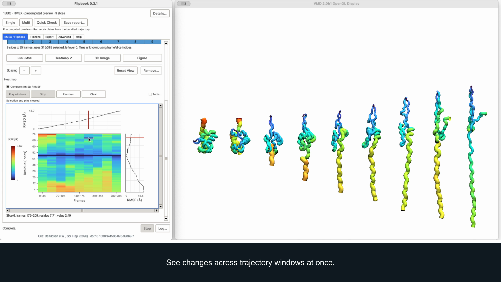
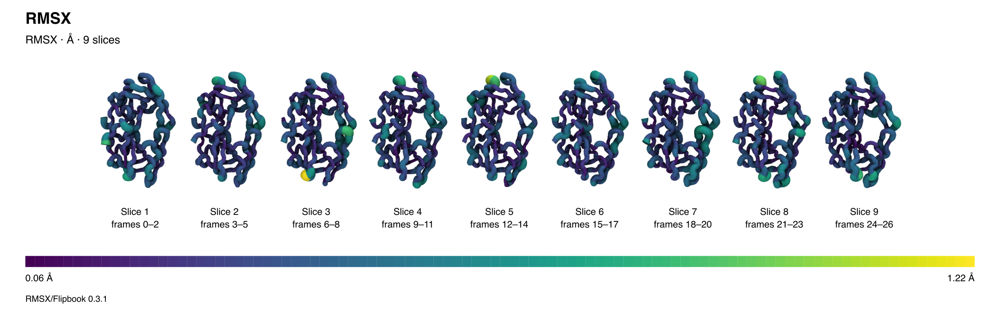

# RMSX / Flipbook for VMD — beta

Compare trajectory windows side by side, with residue-level color and thickness, linked heatmaps, and figure export.

**Beta preview:** feedback welcome. Requires graphical VMD with Tcl/Tk 8.6. See [tested builds and limitations](docs/SUPPORT.md).

## Try it in VMD

The one-file beta download is not published yet. If you already have the supplied beta file:

1. Save **`TRY_RMSX_0.3.1.vmd`**.
2. In VMD, choose **File → Load Visualization State…**.
3. Select the file. The nine-slice example opens automatically.

**Click Run to calculate it yourself.** Inputs are already filled in—no path editing, extraction, terminal commands, or plugin installation. Once downloaded, the file works without a network connection.

On Windows, click **Open fresh VMD** if prompted to enable residue thickness.

[Quick start](docs/QUICK_START.md) · [Optional source installation](rmsxflipbooktimeline0.3.1/INSTALL.md)

## Tested systems

| System | VMD build | Native test suite |
|---|---|---|
| macOS · Apple Silicon | 2.0b1 | 80/80 passed |
| macOS · Apple Silicon | 2.0.0a7-pre2 | 80/80 passed |
| macOS · Intel | 1.9.4a57 | 80/80 passed |
| Windows · x64 | 2.0.0a6 | 80/80 passed |
| Linux · x64 | 2.0.1a1 | 80/80 passed |

These full-suite results cover revision `a4c60d3`. Later changes have focused regression checks; full qualification of the final beta download is pending. [Test evidence and limitations](docs/SUPPORT.md).

## See it in 30 seconds

**[Watch the demo — 1440p](https://github.com/AntunesLab/rmsx-flipbook-vmd/raw/refs/heads/main/docs/media/demo-30s-1440p.mp4)**

## High-resolution Tachyon figure

[Full-resolution image](docs/media/protease-tachyon-hd.png) · [Media settings](docs/media/README.md)

## Feedback and development

[Report a problem](https://github.com/AntunesLab/rmsx-flipbook-vmd/issues) with your VMD version, operating system, and what happened. **Quick Check → Save report…** provides optional diagnostics; review local paths before sharing.

- [User guide](rmsxflipbooktimeline0.3.1/USER_GUIDE.md) · [Scientific methods](docs/METHODS.md)
- [Verification](docs/VERIFICATION.md) · [Maintainer guide](docs/MAINTAINING.md) · [Example settings](docs/HANDOFF.md)
- [Changelog](CHANGELOG.md) · [License](LICENSE) · [Third-party notices](THIRD_PARTY_NOTICES.md) · [Provenance](docs/PUBLICATION_AUDIT.md)

This beta is a standalone extension, not an official VMD distribution. Normal use needs only VMD; Python is for optional development tools.
