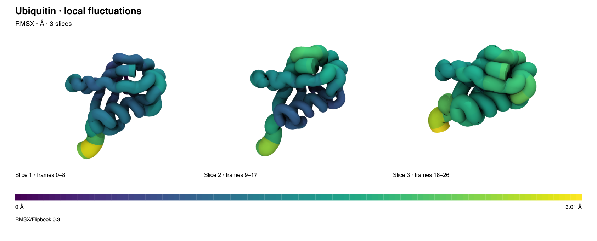
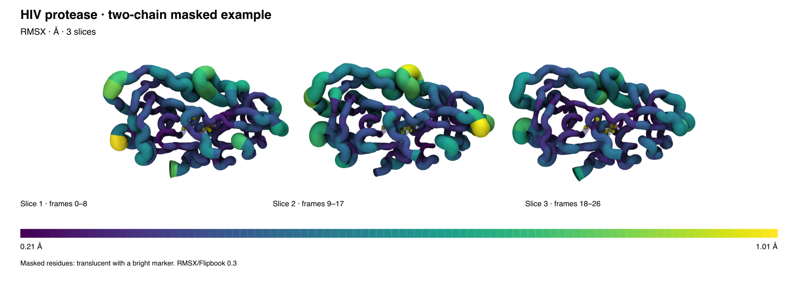

# A first RMSX/Flipbook session

Install the 0.3 review archive using the [installation guide](../rmsxflipbooktimeline0.3/INSTALL.md),
then choose **Extensions → Analysis → RMSX and Flipbook Timeline**. The dashboard
keeps five native Tk tabs. Its header always describes the current result;
editing the input fields prepares another calculation without changing it.

## Single-chain example

From a clean checkout, launch the disposable ubiquitin demonstration:

```sh
python3 scripts/launch.py --vmd /path/to/vmd --demo single
```

For the figure below, use RMSX, chain `7`, frames `0–26`, and three slices.
Leave time unspecified: this fixture has no established physical frame interval.
The nine-frame slices are labeled by frame bounds. The Output field is a parent
directory; each successful calculation is published in its own run folder.
Run starts checkpoint progress; Stop requests cancellation after the current
VMD calculation returns.



The clean molecular image and its editable, self-contained
[SVG figure](figures/ubiquitin.svg) come from the native export path. The legend
reports the applied display range in ångströms. PNG export uses VMD rendering
and the extension's Tcl conversion code.

## Multichain example with a mask

```sh
python3 scripts/launch.py --vmd /path/to/vmd --demo multi
```

Use RMSX, all chains, frames `0–26`, three slices, and mask selection
`resid 25:26`. Chain and segment identity remain distinct throughout analysis,
loading and selection. Masks retain their identity through CSV/PDB interchange.



[Open the editable protease SVG](figures/protease.svg). Masked residues use the
plugin's translucent representation and bright marker. These small examples
demonstrate the interface; they are not claims about equilibrium sampling.

## Select, export and clean up

1. Focus a heatmap with Tab. Use arrows, Home/End or Ctrl+Home/End to navigate;
   Enter activates the cell and Escape clears highlighting. Mouse selection
   uses the same structure-linking action.
2. Use **3D Image**, **Figure**, or **Matrix** for the current result. Default
   3D framing fits the owned structures with a small margin while keeping their
   orientation. Current view and the RMSX preset are explicit alternatives.
3. Close the panel to keep the displayed scene. Reopen it from Extensions.
   Use **Remove** to delete the plugin's result resources and restore settings
   still equal to the plugin's last applied values.
4. If calculation is saved but display activation fails, retain the output
   folder and use the saved-result retry action. The previous result stays active.

To regenerate both native analyses and 2400-pixel PNG/SVG exports, set
`RMSX_EXAMPLE_REPO` to the checkout and `RMSX_EXAMPLE_OUTPUT` to a new output
directory, then launch **windowed VMD** with
`-e scripts/make_meeting_examples.tcl`. An explicit `COMPLETED.tcldict` receipt
marks successful completion. The generation script never overwrites an existing
result. The [meeting walkthrough](MEETING.md) and [methods](METHODS.md) explain
the review sequence and scientific conventions.

### Linked comparison plots

Keep **Compare: RMSD / RMSF** enabled above the heatmap. RMSD shows displacement over frames; click its curve area to choose a slice while retaining the selected residue. RMSF shows residue fluctuations over the analyzed trajectory; click its curve area to choose a residue while retaining the selected slice. Hover shows the value in Å. Heatmap selection adds red guides to both comparison plots. Each chain retains its own RMSF mapping. RMSD linking uses the current result’s actual frame ranges; folders without that metadata remain hover-only for RMSD.

### Result details and diagnostics

The one-line header identifies the displayed dataset, metric, and slice/frame count. **Details…** expands Result Details for the frame ranges, chain/group, selection, input/output paths, and method. **Copy Details** copies that metadata. **Log…** opens diagnostics; **Save Log…** saves the current result details and diagnostic history together. **Hide** collapses the panel. Opening either panel does not change the current result or the bottom status message.

The main tab groups source choice and file paths under **Inputs**. The first action row runs analysis or opens/exports the result; the second keeps **Spacing − / +**, **Reset View**, and **Remove…** together. **Retry view** appears only when a saved calculation needs display recovery, and the progress bar appears during an operation.
